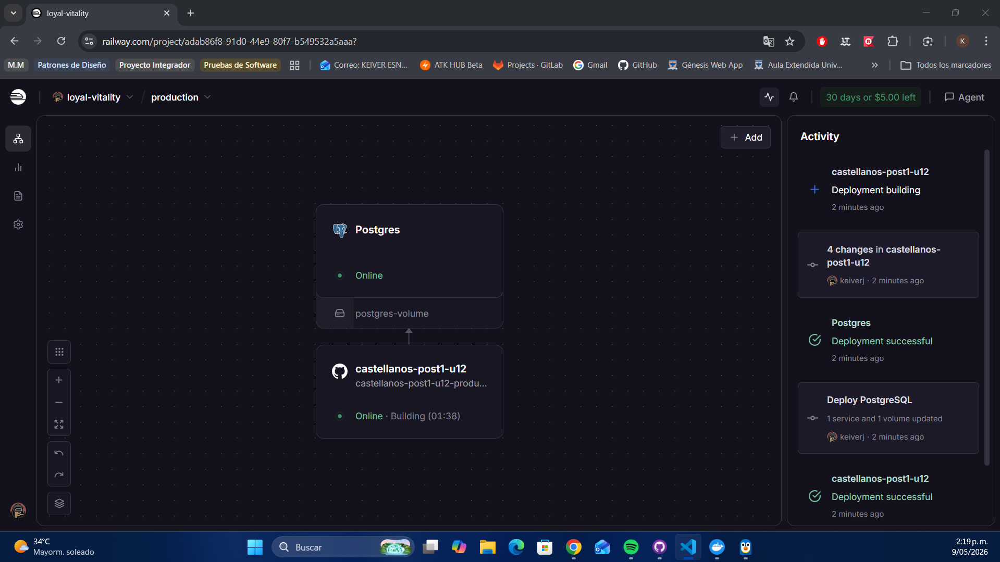
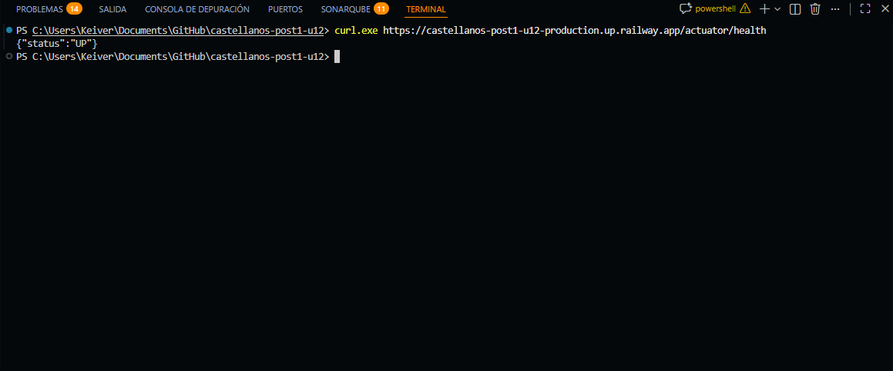
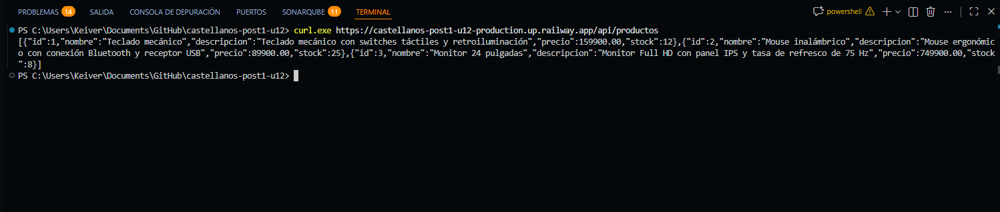
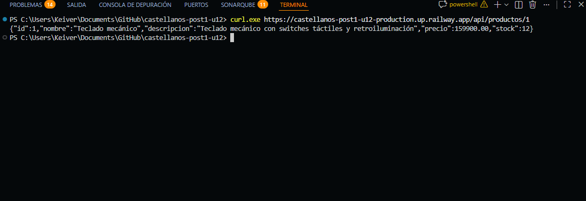
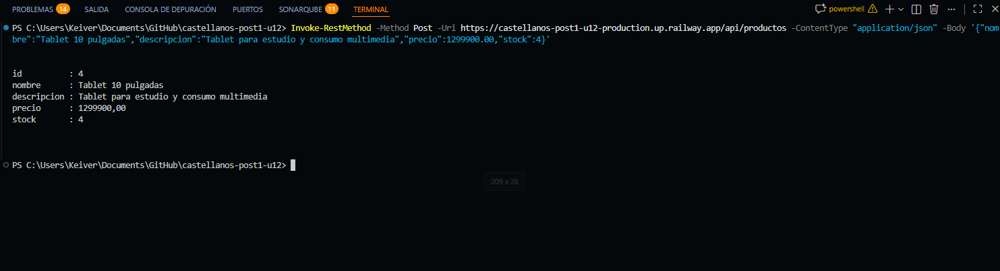
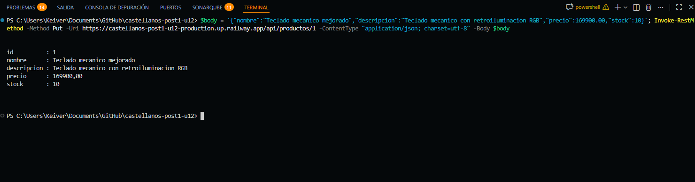

# API Catálogo de Productos — Despliegue y CI/CD

> **UDES · Ingeniería de Sistemas 2026**  
> Programación Web · Unidad 12 · Post-Contenido 1  
> Contenerización con Docker, orquestación local y despliegue en Railway

---

## Objetivo

Contenedorizar una aplicación Spring Boot mediante un Dockerfile multi-stage, separar los ambientes de desarrollo y producción por perfiles, orquestar localmente con Docker Compose y desplegar la solución en Railway con PostgreSQL conectado y endpoints REST funcionales.

---

## Estado de la entrega

| Criterio | Estado | Evidencia |
| --- | --- | --- |
| Implementación técnica | Excelente | Dockerfile multi-stage, usuario no root, perfil `prod` activo por variables y despliegue estable en Railway |
| Funcionalidad de la API | Excelente | `GET /actuator/health`, `GET /api/productos`, `GET /api/productos/1`, `POST` y `PUT` verificados en producción |
| Documentación técnica | Excelente | README con comandos, variables, URL pública y capturas inline |
| Calidad del código y estructura | Excelente | `.dockerignore`, `docker-compose.yml` con healthcheck, manejo de errores y capas separadas |

---

## Tecnologías y versiones

| Tecnología | Versión / uso |
| --- | --- |
| Java | 21 |
| Spring Boot | 3.4.5 |
| Maven | 3.9.12 |
| PostgreSQL | 18.3 administrado por Railway |
| H2 | En memoria para desarrollo y pruebas |
| Docker | Multi-stage con JDK para compilación y JRE para ejecución |
| Docker Compose | 3.9 con healthcheck |
| IDE | VS Code |
| SO | Windows 11 |

---

## Arquitectura del proyecto

```text
castellanos-post1-u12/
├── Dockerfile
├── docker-compose.yml
├── pom.xml
├── README.md
├── capturas/
├── src/
│   ├── main/
│   │   ├── java/co/edu/udes/castellanos/post1u12/
│   │   │   ├── config/
│   │   │   ├── domain/
│   │   │   ├── repository/
│   │   │   ├── service/
│   │   │   └── web/
│   │   └── resources/
│   │       ├── application.properties
│   │       ├── application-dev.properties
│   │       ├── application-prod.properties
│   │       ├── data.sql
│   │       └── db/migration/
│   └── test/
└── .dockerignore
```

---

## Arquitectura funcional

```text
Cliente HTTP
   |
   v
Controller REST
   |
   v
Service
   |
   v
Repository JPA
   |
   v
Base de datos
   |-- Dev: H2 en memoria
   '-- Prod: PostgreSQL
```

La aplicación sigue una arquitectura por capas para separar el acceso HTTP, la lógica de negocio y la persistencia.

---

## Prerrequisitos

- Java 21 instalado.
- Maven 3.9.12 o superior.
- Docker Desktop en ejecución.
- Cuenta gratuita de Railway vinculada a GitHub.
- Git Bash o PowerShell en Windows.

---

## Ejecución local paso a paso

### 1. Validar la compilación

```bash
mvn test
```

### 2. Levantar la app en desarrollo

```bash
mvn spring-boot:run
```

### 3. Verificar la respuesta local

```bash
curl http://localhost:8080/actuator/health
curl http://localhost:8080/api/productos
curl http://localhost:8080/api/productos/1
```

Respuesta esperada del healthcheck:

```json
{ "status": "UP" }
```

---

## Ejecución con Docker

### 1. Construir la imagen

```bash
docker build -t castellanos-post1-u12:local .
```

### 2. Levantar el stack completo

```bash
docker compose up -d --build
```

### 3. Revisar el estado de los contenedores

```bash
docker compose ps
```

### 4. Validar el healthcheck

```bash
curl http://localhost:8080/actuator/health
```

### 5. Probar los endpoints REST

```bash
curl http://localhost:8080/api/productos
curl http://localhost:8080/api/productos/1
curl -X POST http://localhost:8080/api/productos -H "Content-Type: application/json" -d "{\"nombre\":\"Tablet 10 pulgadas\",\"descripcion\":\"Tablet para estudio y consumo multimedia\",\"precio\":1299900.00,\"stock\":4}"
```

---

## Endpoints principales

| Método | Ruta | Descripción |
| --- | --- | --- |
| GET | / | Página raíz con acceso rápido |
| GET | /actuator/health | Verifica el estado de la aplicación |
| GET | /api/productos | Lista todos los productos |
| GET | /api/productos/{id} | Obtiene un producto por id |
| POST | /api/productos | Crea un producto |
| PUT | /api/productos/{id} | Actualiza un producto |
| DELETE | /api/productos/{id} | Elimina un producto |

---

## Despliegue en Railway

### 1. Conectar el repositorio

Crear un proyecto en Railway y usar la opción Deploy from GitHub repo.

### 2. Agregar PostgreSQL

Agregar un servicio PostgreSQL dentro del canvas del proyecto. El nombre visible del servicio es `Postgres`, por lo que las referencias usan ese namespace.

### 3. Configurar variables de entorno

| Variable | Valor |
| --- | --- |
| SPRING_PROFILES_ACTIVE | `prod` |
| DATABASE_URL | `jdbc:postgresql://${{Postgres.PGHOST}}:${{Postgres.PGPORT}}/${{Postgres.PGDATABASE}}?sslmode=require` |
| DB_USER | `${{Postgres.PGUSER}}` |
| DB_PASS | `${{Postgres.PGPASSWORD}}` |

Importante: en Railway, el valor se pega solo en el campo Value. No escribas `DATABASE_URL=` al inicio del contenido. Si el nombre del servicio cambia, reemplaza `Postgres` por el nombre exacto de la tarjeta del servicio.

### 4. Generar dominio público

URL pública final:

https://castellanos-post1-u12-production.up.railway.app/

### 5. Validar desde la terminal

```bash
curl https://castellanos-post1-u12-production.up.railway.app/actuator/health
curl https://castellanos-post1-u12-production.up.railway.app/api/productos
curl https://castellanos-post1-u12-production.up.railway.app/api/productos/1
```

---

## Pruebas ejecutadas

| Prueba | Resultado |
| --- | --- |
| `mvn test` | Éxito |
| `GET /actuator/health` | `UP` |
| `GET /api/productos` | Lista devuelta correctamente |
| `GET /api/productos/1` | Producto 1 devuelto correctamente |
| `POST /api/productos` | Creación exitosa |
| `PUT /api/productos/1` | Actualización exitosa |

---

## Decisiones técnicas

- Se usó arquitectura por capas para mantener una separación clara entre controladores, servicios y repositorios.
- El perfil `dev` usa H2 para pruebas locales rápidas y `data.sql` para datos semilla.
- El perfil `prod` usa PostgreSQL administrado por Railway.
- Se desactivó Flyway en producción por compatibilidad con PostgreSQL 18.3 y se dejó JPA con `ddl-auto=update`.
- El Dockerfile copia primero `pom.xml` para aprovechar caché de capas y reduce la imagen final a JRE.
- `.dockerignore` excluye `target/`, `.git/` y artefactos del entorno para no inflar el build context.

---

## Problemas frecuentes

| Problema | Solución |
| --- | --- |
| `502` en Railway | Revisar variables de entorno, logs de la app y redeploy |
| `500` en `/api/productos/1` | Confirmar que exista el producto semilla o que el PUT se haya ejecutado con JSON válido |
| `HttpMessageNotReadableException` | En PowerShell usar el body JSON correctamente formado, sin pegar `Invoke-RestMethod` dentro del here-string |
| `NoResourceFoundException` en `/` | La app ahora responde con una página raíz simple |

---

## Evidencia final

- URL pública de Railway: https://castellanos-post1-u12-production.up.railway.app/
- Informe final: [Informe PRE1_U12.pdf](Informe%20PRE1_U12.pdf)
- Capturas guardadas en la carpeta `capturas/`.
- Evidencia revisada: panel de Railway, healthcheck, listado, detalle, creación y actualización de productos.

---

## Evidencia visual inline

<table>
  <tr>
    <td align="center"><br><sub>Panel de Railway</sub></td>
    <td align="center"><br><sub>Healthcheck UP</sub></td>
  </tr>
  <tr>
    <td align="center"><br><sub>Listado de productos</sub></td>
    <td align="center"><br><sub>Detalle de producto</sub></td>
  </tr>
  <tr>
    <td align="center"><br><sub>Crear producto</sub></td>
    <td align="center"><br><sub>Producto actualizado</sub></td>
  </tr>
</table>
